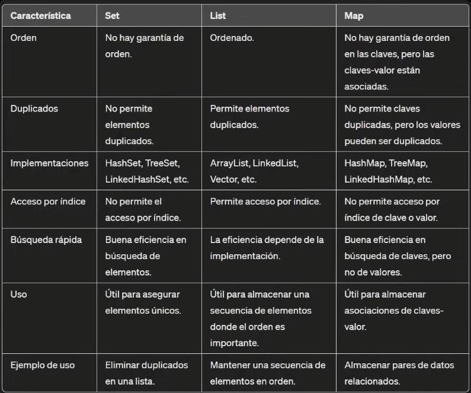
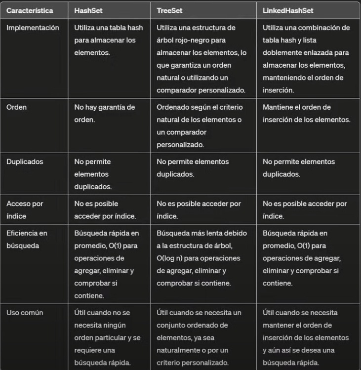
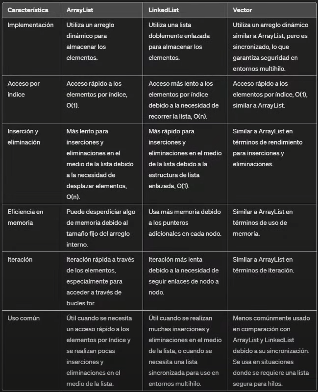
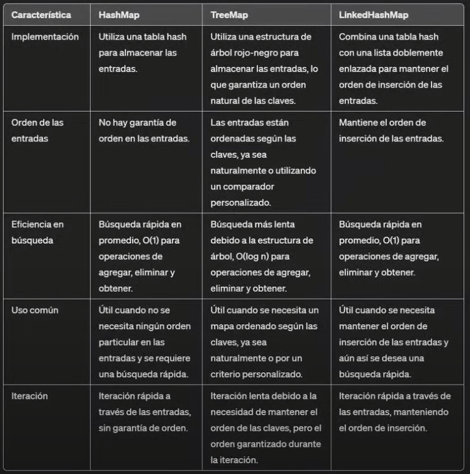

# Colecciones
Una colección es un bjeto que agrupa múltiples elementos en una sola unidad. Estas
colecciones proporcionan una forma más conveniente de trabajar con grupos de objetos
que las simples matrices (arrays) debido a su flexibilidad y funcionalidad adicional.

## Set: tipos de set
Una colección que no permite elememntos duplicdos. Se utiliza para almacenar
elementos únicos sin ningún orden en particular.

## List: tipos de list

Una colección ordenada de elementos que permite elementos duplicados. Los elementos en una lista están indexados y se pueden acceder por su posición.

## Map: tipos de maps

Una colección de claves-valor donde cada clave es única. Se utiliza para almacenar
asociaciones de datos donde cada clave está asociada con un único valor. No 
permite claves duplicadas, pero los valores pueden ser duplicados.

